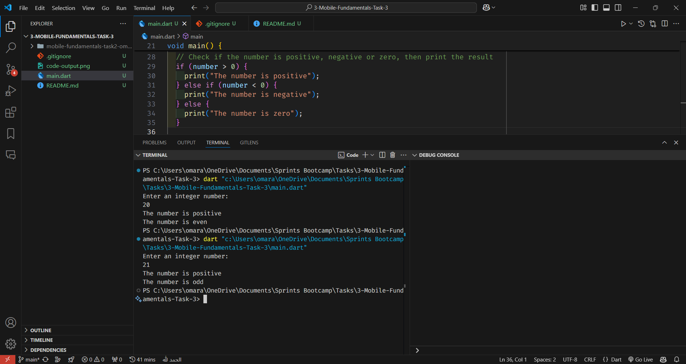

# Check any number positive or negative and even or odd

This program checks any number positive or negative and even or odd using conditions and different operators.

## Requirements

### Requirement 1

**Title:** Check any number positive or negative and even or odd  
**Description:** The program should check any number positive or negative and even or odd using conditions and different operators.

## Code Explanation

```dart
import 'dart:io';

void main() {
  // Declare a variable to store the number
  int number = 0;
  print("Enter an integer number: ");
  // Read the number from the user
  number = int.parse(stdin.readLineSync()!);

  // Check if the number is positive, negative or zero, then print the result
  if (number > 0) {
    print("The number is positive");
  } else if (number < 0) {
    print("The number is negative");
  } else {
    print("The number is zero");
  }

  // Check if the number is even or odd, then print the result
  if (number % 2 == 0) {
    print("The number is even");
  } else {
    print("The number is odd");
  }
}
```

## Code Output

```
Enter an integer number:
20 [User Input]
The number is positive
The number is even
```

## Code Output Screenshot



## How to Run

1. Copy the code into a Dart file.
2. Run the Dart file using a Dart compiler or an IDE that supports Dart.
3. The output will display the number entered by the user and whether it is positive or negative and even or odd.
